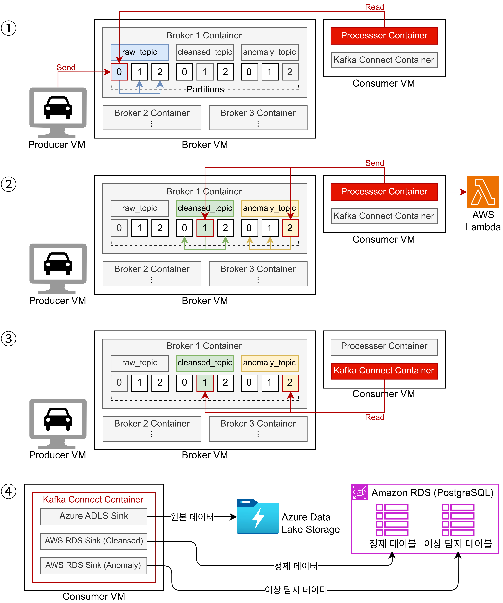
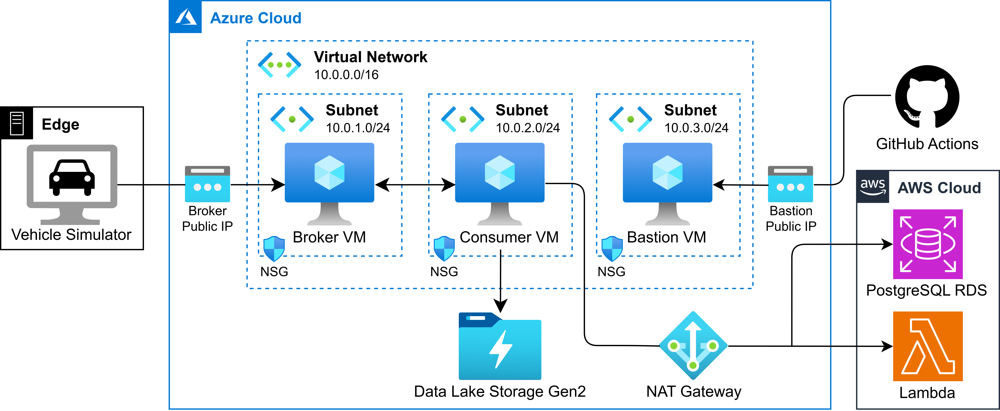
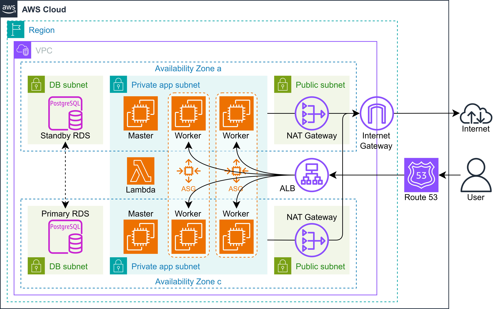
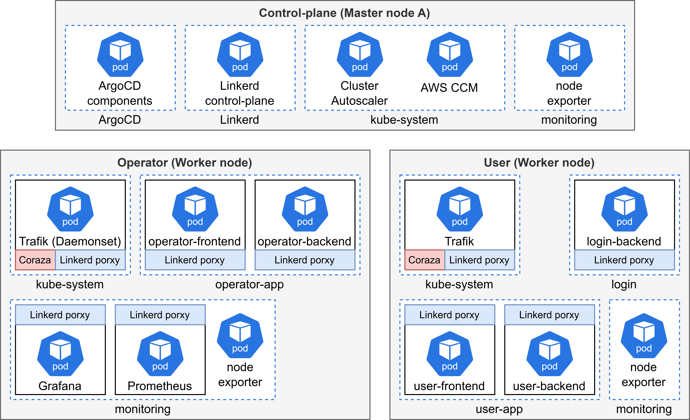
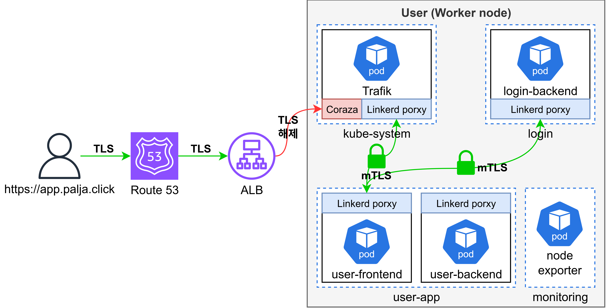

# Hybrid Cloud Data Lake & Service Platform

> ktcloud 클라우드 인프라 부트캠프 2차 프로젝트  
> 하이브리드 클라우드 기반으로 차량 텔레메트리 데이터를 수집, 적재, 분석, 서비스까지 연결한 End-to-End 플랫폼

## 프로젝트 한눈에 보기

이 프로젝트는 Edge에서 발생한 차량 데이터를 Azure와 AWS에 분산 배치된 인프라로 처리하고, 최종적으로 사용자용 서비스와 운영자용 관제 서비스까지 제공하는 하이브리드 클라우드 플랫폼입니다.

단순히 데이터를 모으는 수준이 아니라, 아래 흐름이 하나의 저장소 안에서 모두 연결됩니다.

- Edge 시뮬레이터가 차량 텔레메트리와 이상 상황을 생성
- Azure에서 Kafka 기반 실시간 파이프라인으로 원천 데이터와 정제 데이터를 분기 처리
- AWS에서 RDS, Kubernetes, 모니터링 스택을 기반으로 서비스 플랫폼 운영
- 사용자 대시보드와 운영자 대시보드를 분리해 실제 서비스/관제 시나리오 구현
- GitHub Actions + Terraform + Ansible로 인프라와 애플리케이션 배포 자동화

## 프로젝트 의의

이 프로젝트는 현대오토에버의 HCloud 전략을 레퍼런스로 삼아, 실제 엔터프라이즈 환경에서 활용되는 하이브리드 클라우드 아키텍처를 프로젝트 수준에서 구현해본 사례입니다.

Azure와 AWS의 역할을 분리하고, 데이터 파이프라인, Kubernetes 기반 서비스 운영, IaC, CI/CD 자동화까지 하나의 흐름으로 연결하면서 클라우드 아키텍처에 대한 실무형 설계 감각을 확보하는 데 의미를 두었습니다.

## 기술적 강점

- 데이터 수집 계층과 서비스 계층의 책임을 분리해 하이브리드 클라우드 구조를 설계했습니다.
- 원천 데이터 보관, 서비스용 정제 데이터, 이상 탐지 알림 흐름을 분리해 목적별 데이터 파이프라인을 구성했습니다.
- AWS/Azure 인프라를 Terraform으로 선언형 관리하고, Ansible과 GitHub Actions를 연계해 재현 가능한 운영 환경을 구축했습니다.
- K3s, Argo CD, Linkerd, Prometheus, HPA, Cluster Autoscaler를 포함한 플랫폼 운영 구성을 적용했습니다.
- React + Express 기반으로 사용자/운영자 분리형 서비스와 운영 관제 화면을 구현했습니다.
- Bastion 경유 접근, 세션 기반 인증, Slack 알림 연계를 포함해 운영 및 보안 관점까지 고려했습니다.

## 문제 정의

차량에서 발생하는 대량의 실시간 데이터를 안정적으로 수집하고,  
이 데이터를 원천 보관과 서비스 제공이라는 두 목적에 맞게 분리 처리하며,  
운영자가 즉시 이상 상황을 탐지하고 대응할 수 있는 플랫폼이 필요했습니다.

이를 위해 다음 세 가지를 핵심 목표로 두었습니다.

1. 데이터 수집과 서비스 계층을 분리해 확장성과 운영성을 확보한다.
2. 원천 데이터 보관과 서비스용 정제 데이터를 분리해 데이터 활용성을 높인다.
3. 인프라 구축부터 애플리케이션 배포까지 자동화해 재현 가능한 운영 환경을 만든다.

## 전체 아키텍처


### 아키텍처 핵심 설계

- Edge는 실제 단말 대신 Python 기반 차량 시뮬레이터로 구성해 대량 텔레메트리와 이상 이벤트를 재현합니다.
- Azure는 Kafka Broker, Consumer, Data Lake 연계 계층으로 사용해 스트리밍 수집과 데이터 분기를 담당합니다.
- AWS는 사용자 서비스, 운영 대시보드, 데이터베이스, Kubernetes 운영 환경을 담당합니다.
- 데이터는 raw 보관 경로와 cleansed/alert 서빙 경로로 나뉘며, 서비스는 정제된 데이터를 사용합니다.
- 운영자는 이상 탐지 현황과 차량 상태를 별도 대시보드에서 확인하고, 중요 이벤트는 Slack으로 전달됩니다.

## 데이터 파이프라인



### 처리 흐름

1. `infra/edge/vehicle_simulator.py`에서 100대 규모 차량 상태를 가상 생성합니다.
2. 속도, 위치, 연료량, 엔진 상태, 이벤트 타입을 Kafka `raw_topic`으로 전송합니다.
3. Azure Consumer가 메시지를 소비하면서 정제 데이터와 이상 이벤트를 분리합니다.
4. 원천 데이터는 Data Lake 보관용 경로로 적재됩니다.
5. 정제 데이터는 AWS RDS PostgreSQL의 `vehicle_stats`로 적재됩니다.
6. 이상 탐지 데이터는 `vehicle_anomaly_alerts`로 적재됩니다.
7. 이상 이벤트는 별도 웹훅을 통해 AWS Lambda로 전달되고, 최종적으로 Slack 알림으로 이어집니다.

### 이 파이프라인에서 강조할 포인트

- 스트리밍 데이터와 서비스 데이터의 목적을 분리해 설계했습니다.
- 이상 탐지를 데이터 적재와 별도로 처리해 운영 대응 시간을 줄였습니다.
- 원천 데이터 보관과 실시간 서비스 제공을 동시에 만족하는 구조를 만들었습니다.

## 클라우드 역할 분담

### Azure



- Kafka Broker와 Consumer VM을 운영합니다.
- Bastion host를 통해 사설 구간에 안전하게 접근합니다.
- Kafka Connect 기반 Consumer가 데이터 정제, 이상 탐지, 외부 웹훅 호출을 수행합니다.
- Raw 데이터 보관을 위한 Data Lake 적재 흐름을 담당합니다.

### AWS



- VPC, Public/Private/App/DB 계층 분리 네트워크를 Terraform으로 구성합니다.
- ALB + Route 53 + ACM으로 사용자/운영자 서비스 도메인을 외부에 노출합니다.
- RDS PostgreSQL을 서비스용 저장소로 사용합니다.
- K3s 기반 Kubernetes 클러스터를 구성하고 사용자/운영자 워커 풀을 분리 운영합니다.
- Lambda Function URL을 통해 이상 알림을 받아 Slack으로 전달합니다.

## Kubernetes 플랫폼 구조



이 프로젝트의 Kubernetes 계층은 단순 컨테이너 실행 환경이 아니라, 운영 플랫폼 관점에서 구성되어 있습니다.

- 가용성 향상을 위해 2개 AZ에 K3s control plane(master)을 분산 배치하고, 내부 NLB로 공통 API 엔드포인트를 구성했습니다.
- 다만 본 프로젝트는 교육용/실습 환경 제약을 고려한 구성으로, 운영 환경에서 일반적으로 고려하는 다중 quorum 기반의 고가용성 control plane 설계와는 차이가 있습니다.
- User 워커 풀과 Operator 워커 풀을 분리하고, taint/label 기반으로 워크로드를 나눴습니다.
- Argo CD로 배포 기준점을 만들고, Prometheus/Grafana로 관측성을 확보했습니다.
- Linkerd를 포함해 서비스 메시 기반 운영 확장 가능성을 열어두었습니다.
- HPA와 Cluster Autoscaler를 통해 Pod와 노드 단의 확장 구조를 준비했습니다.

### 실제 매니페스트 기준 운영 요소

- `k8s/frontend-user-app/hpa.yaml`
- `k8s/backend-user/hpa.yaml`
- `k8s/frontend-operator-app/*.yml`
- `k8s/backend-login`, `k8s/backend-user`, `k8s/backend-operator`

## 보안 아키텍처



보안 측면에서도 포트폴리오에서 설명하기 좋은 요소가 들어 있습니다.

- Azure는 Bastion 경유 접근 구조를 사용합니다.
- AWS는 Public ALB와 Private App/DB 계층을 분리했습니다.
- RDS 접근은 애플리케이션 계층과 허용된 소스에 한정됩니다.
- 운영 알림 웹훅은 토큰 검증을 거치도록 구현했습니다.
- 백엔드는 HMAC 기반 세션 토큰 검증과 역할 기반 접근 제어를 사용합니다.
- 사용자용 화면과 운영자용 화면을 분리해 권한 경계를 명확히 했습니다.

## 서비스 구성

### 사용자 서비스

- 회원가입 및 로그인
- 차량-사용자 매핑 기반 개인 대시보드 제공
- 최근 위치, 속도, 연료량, 주행 상태, 최근 알림 확인
- 최근 주행 거리와 운행 시간 기반 요약 정보 제공

### 운영자 서비스

- 전체 차량 상태 대시보드
- 운행 중/정차/시동 OFF/오프라인 상태 분류
- 최근 차량 위치와 상태 변화 모니터링
- 이상 탐지 통계, 최근 알림, 히트맵 형태의 관제 데이터 제공
- Grafana 임베드 확장 구조 포함

### 백엔드 설계 포인트

- `APP_TARGET` 기반으로 로그인, 사용자, 운영자 API를 분기하는 구조를 사용합니다.
- 공통 코드베이스에서 역할별 API를 나눠 운영 복잡도를 줄였습니다.
- 초기 스키마 생성과 개발용 시드 계정 주입 로직이 포함되어 있습니다.
- PostgreSQL 쿼리 기반으로 대시보드 가공 데이터를 서버에서 직접 조합합니다.

## 핵심 구현 포인트

### 1. Edge-to-Cloud 데이터 생성과 수집

- 차량 100대를 스레드 기반으로 시뮬레이션합니다.
- 주행, 정차, 시동 OFF 상태를 구분해 전송 주기를 다르게 설정했습니다.
- 급가속, 급감속, GPS 이상, 데이터 폭주, 미수신, 저연료 같은 이상 상황을 의도적으로 생성합니다.

### 2. Raw / Cleansed / Alert 분리형 데이터 처리

- 원천 데이터는 보관 중심으로 유지합니다.
- 정제 데이터는 서비스 조회에 적합한 형태로 가공합니다.
- 이상 이벤트는 별도 테이블과 알림 채널로 분리해 운영 가시성을 높였습니다.

### 3. 사용자/운영자 멀티 앱 구조

- 프론트엔드와 백엔드를 사용자용, 운영자용, 로그인용으로 분리했습니다.
- 같은 코드베이스를 목적별 이미지로 빌드해 재사용성과 운영 효율을 동시에 확보했습니다.
- 운영자 화면은 차량 상태 관제와 이상 이벤트 대응에 최적화되어 있습니다.

### 4. 재현 가능한 인프라 자동화

- AWS 네트워크, 데이터, 컴퓨트, 알림 계층을 Terraform 모듈로 분리했습니다.
- Azure도 Terraform + Ansible 조합으로 브로커/컨슈머 환경을 자동화했습니다.
- GitHub Actions로 이미지 빌드, 인프라 적용, VM 구성, 앱 배포 흐름을 연결했습니다.

### 5. 운영 친화적 플랫폼 설계

- Prometheus/Grafana 모니터링 스택을 포함했습니다.
- HPA와 Cluster Autoscaler로 확장 구조를 고려했습니다.
- Slack 알림으로 이상 상황을 실시간 공유할 수 있게 만들었습니다.

## 기술 스택

| 영역 | 기술 |
| --- | --- |
| Frontend | React 18, React Router, Vite, Tailwind CSS |
| Backend | Node.js, Express, PostgreSQL |
| Edge | Python, Docker Compose |
| Streaming | Kafka, Kafka Consumer/Producer, Kafka Connect |
| Data Layer | Azure Data Lake, AWS RDS PostgreSQL |
| AWS Infra | Terraform, EC2, ASG, ALB, NLB, Route 53, ACM, Lambda |
| Azure Infra | Terraform, Bastion, VM, Ansible |
| Platform | K3s, Argo CD, Linkerd, Prometheus, Grafana, HPA |
| CI/CD | GitHub Actions, Docker Hub |

## 저장소 구조

```text
.
├─ .github/workflows/        # AWS/Azure 인프라 및 앱 배포 자동화
├─ apps/web-platform/        # 사용자/운영자/로그인 웹 플랫폼
│  ├─ backend/               # Express API
│  └─ frontend/              # React UI
├─ architecture/             # 아키텍처 다이어그램 산출물
├─ infra/
│  ├─ aws/
│  │  ├─ terraform/          # 네트워크, 데이터, 컴퓨트, 알림 계층
│  │  ├─ ansible/            # K3s 및 운영 스택 구성
│  │  └─ lambda/             # Slack anomaly notifier
│  ├─ azure/
│  │  ├─ terraform/          # Bastion/Broker/Consumer 인프라
│  │  └─ ansible/            # Kafka Broker/Consumer 구성
│  └─ edge/                  # 차량 시뮬레이터
└─ k8s/                      # 서비스 배포 매니페스트
```

## CI/CD와 운영 자동화

### GitHub Actions 워크플로

- `aws-deploy.yml`
  AWS 네트워크, 컴퓨트, 데이터, 알림 인프라를 Terraform으로 배포합니다.
- `aws-app-deploy.yml`
  로그인/사용자/운영자 앱 이미지를 빌드하고 배포합니다.
- `azure-deploy.yml`
  Azure Broker/Consumer 환경을 만들고 Ansible로 Kafka 파이프라인 구성을 적용합니다.

### 자동화 관점에서 보여줄 수 있는 점

- 인프라와 애플리케이션 배포가 수동 절차가 아니라 코드와 워크플로로 관리됩니다.
- 클라우드가 2개여도 역할을 분리해 배포 복잡도를 통제하고 있습니다.
- 데이터 파이프라인 변경과 서비스 배포를 같은 저장소에서 추적할 수 있습니다.

## 데이터 모델

서비스 핵심 테이블은 아래와 같습니다.

- `accounts`
- `vehicle_master`
- `user_vehicle_mapping`
- `vehicle_stats`
- `vehicle_anomaly_alerts`
- `model_codes`

이 구조를 통해 사용자-차량 매핑, 최신 차량 상태 조회, 이상 이벤트 관제까지 하나의 서비스 흐름으로 연결합니다.

## 실행 및 참고 경로

### 주요 진입점

- Edge Simulator: `infra/edge/vehicle_simulator.py`
- Azure Consumer: `infra/azure/ansible/roles/kafka-consumer/files/processor.py`
- Backend API: `apps/web-platform/backend/src/server.js`
- AWS Lambda Alert: `infra/aws/lambda/slack-anomaly-notifier/index.mjs`

### 관련 문서

- Azure 접근 가이드: `infra/azure/terraform/README.md`
- AWS Ansible 운영 가이드: `infra/aws/ansible/README.md`
- Edge 실행 가이드: `infra/edge/README.md`
- Workflow 설명: `.github/workflows/README.md`

## 회고

이 프로젝트는 웹 서비스 구현, 데이터 파이프라인 설계, 멀티 클라우드 인프라 운영, 배포 자동화를 하나의 흐름으로 통합해본 실전형 프로젝트입니다.

특히 하이브리드 클라우드 환경에서의 역할 분리, 스트리밍 데이터 처리, Kubernetes 기반 서비스 운영, IaC와 CI/CD 자동화를 함께 다루며 클라우드 아키텍처를 실무 관점에서 설계하고 구현해보는 경험을 쌓을 수 있었습니다.
