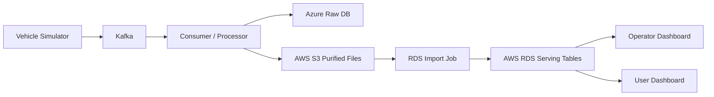

# Architecture

## Summary

이 프로젝트는 차량 시뮬레이터가 생성한 이벤트를 멀티클라우드 환경에서 수집/정제하고, AWS 퍼블릭 클라우드에서 대시보드 서비스로 제공하는 구조를 목표로 합니다.

- 상류 데이터 처리 구간: Azure 기반 데이터 수집/처리 영역
- 서비스 제공 구간: AWS VPC 기반 대시보드/데이터 서빙 영역
- 조회 기준: 대시보드는 S3가 아니라 RDS serving table만 조회
- 반영 방식: 1~5분 단위 마이크로배치 near-real-time

## Current Target Architecture

## AWS Public Cloud Scope

- 인터넷 진입점은 `ALB` 단일화
- `WAF -> ALB` 구조를 목표로 하지만, WAF는 현재 Phase 1 구현 범위에서 보류
- 서비스 워크로드는 `Private App Subnet`
- RDS는 `Private DB Subnet`
- S3 연동은 `Gateway Endpoint` 우선
- 운영자 접근은 `Bastion Host + 허용된 관리자 IP` 기준
- K3s는 `1 master + 3 worker` 초안 기준으로 설계
- NAT Gateway는 비용 절감을 위해 1대만 사용

## Phase 1 AWS Placement

- `Public-A`: ALB, NAT Gateway, Bastion Host
- `Public-C`: ALB
- `Private-App-A`: K3s master 1, worker 1
- `Private-App-C`: worker 2대
- `Private-DB-A/C`: 단일 RDS 인스턴스를 위한 DB Subnet Group
- `S3 Gateway Endpoint`: Private Route Table과 연결
- `RDS`: 인스턴스는 1대만 생성, DB Subnet은 2개 준비

## AWS Network Baseline

- Region: `ap-northeast-2`
- AZ: `2개`
- Subnet 구성:
  - Public 2개
  - Private App 2개
  - Private DB 2개
- Route 기준:
  - Public -> IGW
  - Private App -> NAT Gateway
  - Private DB -> 내부 통신 전용

## Ownership Boundary

- 인프라 1: VPC, Subnet, Route, NAT, S3 Endpoint, SG, ALB
- 인프라 2: EC2, Launch Template, ASG, K3s, Linkerd, Ansible
- 인프라 3: S3, RDS, DB Subnet Group, import 흐름
- 인프라 4: Dashboard 배포, GitHub Actions, 헬스체크

## Open Items

- Azure 처리 구간 상세 리소스와 네트워크 연결 방식
- WAF 적용 시점과 규칙 초안
- RDS import 파일 포맷 최종 결정
- ALB Listener/Target Group/Ingress 규칙 확정
